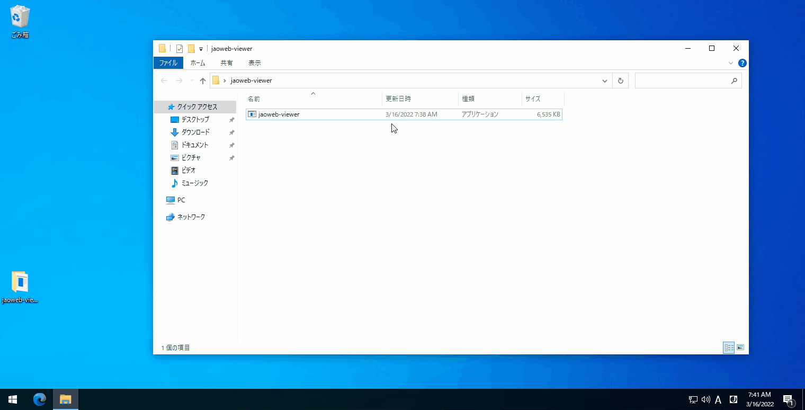

# jaoweb-viewer (α)

[jaoafa/jaoweb-docs](https://github.com/jaoafa/jaoweb-docs) の更新作業時用ビュアー

## 機能

- `localhost:8080` でプレビュー表示
- 起動時に最新の [jaoweb](https://github.com/jaoafa/jaoweb) をクローンし、`jaoweb` ディレクトリに配置
- `.gitignore` に `jaoweb-viewer*` と `jaoweb/` がない場合に自動追加する
- 内容の更新時にリロード

## 使う

このツールを利用する際は、最低限 Git の環境が必要です。`git` コマンドが使える必要があります。

1. [Release](https://github.com/jaoafa/jaoweb-viewer/releases) から最新のリリースページを開き、お使いの OS に対応するパッケージをダウンロードしてください。
   - Windows: `_windows_x86_64.zip`
   - macOS M1 系: `_macOS_arm64.tar.gz`
   - macOS Intel x86_64 系: `_macOS_x86_64.tar.gz`
2. 適切に展開し、`jaoweb-viewer.exe` または `jaoweb-viewer` を実行してください。
   そのままでも実行できますが、コマンドプロンプト・PowerShell・Bash といったシェル環境で動作させることをお勧めします。
3. 途中で「`jaoweb-docsが未ダウンロードのため、git cloneによるダウンロードを行います。`」と言われ、`あなたのGitHubアカウント名` を求められます。
   自分のアカウントに jaoafa/jaoweb-docs をフォークした上で、あなたの GitHub アカウント名（`book000` など）を入力してください。
4. ブラウザでプレビューページが、Visual Studio Code がインストール済みの場合は自動的にコンテンツフォルダで起動されます。
5. 上手にお使いください。

## 動作フロー

1. `git` の存在確認
2. `.gitignore` に追加
3. `latest-v14` の nodejs ポータブルをダウンロード
4. `jaoweb` フォルダが存在しない場合は [jaoafa/jaoweb](https://github.com/jaoafa/jaoweb) のクローン、存在する場合は `git pull`
5. `jaoafa/jaoweb-docs` をクローン
6. `yarn install` による依存パッケージのダウンロード
7. `localhost:3000` をブラウザで表示
8. `yarn dev` による開発サーバの起動
9. Visual Studio Code がインストールされている場合は、コンテンツフォルダで起動

## 既知の不具合

- ファイルの削除・リネーム時に動作しない
